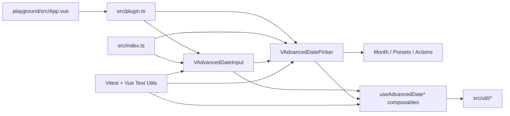

# Project Overview

`@gigerit/vuetify-date-input-advanced` is a Vue 3 and Vuetify 4 library that exposes
an advanced date picker panel and a text-input wrapper for multi-month,
range-focused date selection. The repo includes the source library in `src/`,
a local playground in `playground/`, Vitest coverage in `tests/`, and a
committed `dist/` build output.

## Repository Structure

- `.git/` Git metadata for the repository.
- `dist/` Generated library bundles, CSS, and declaration files from Vite.
- `node_modules/` Installed dependencies; do not edit manually.
- `playground/` Local Vite app used for manual QA of the components.
- `src/` Library source code, including components, composables, utilities,
  plugin entry points, and styles.
- `tests/` Vitest suites plus the shared Vuetify test mount helper.
- `.gitignore` Ignore rules for dependencies, build artifacts, and logs.
- `eslint.config.mjs` Flat ESLint configuration for TS, TSX, and Vue files.
- `package-lock.json` npm lockfile.
- `package.json` Package metadata, scripts, peers, and dev dependencies.
- `prettier.config.mjs` Prettier rules for semicolons, quotes, and commas.
- `tsconfig.build.json` Build-time TS config for declarations from `src/`.
- `tsconfig.json` Primary strict TypeScript config and path aliases.
- `vite.config.ts` Vite library-mode build config with Vuetify and DTS.
- `vitest.config.ts` Vitest config using jsdom and inline Vuetify deps.

## Build & Development Commands

Install dependencies:

```sh
npm install
```

Run the playground locally:

```sh
npm run dev
```

Build the library bundle:

```sh
npm run build
```

Type-check the repo:

```sh
npm run typecheck
```

Run tests once:

```sh
npm run test
```

Run tests in watch mode:

```sh
npm run test:watch
```

Run linting:

```sh
npm run lint
```

Format the repo:

```sh
npm run format
```

Debug workflow:

```sh
npm run test:watch
```

- GitHub release automation lives in `.github/workflows/release.yml`; `release-please` manages release PRs and npm publication uses GitHub OIDC trusted publishing instead of an `NPM_TOKEN`.
- npm trusted publishers only work after the package already exists on npm, so the first release still needs a manual publish by an authenticated maintainer before the OIDC workflow can take over.

> TODO: No dedicated debug script or preview script is defined.

## Code Style & Conventions

- Language stack: TypeScript, TSX, Vue SFCs, and Sass.
- Module system: ESM with `type: "module"`.
- TypeScript is strict and uses the `@/` alias for `src/*`.
- Prettier rules: no semicolons, single quotes, trailing commas.
- ESLint requires `@typescript-eslint/consistent-type-imports`.
- Unused TS variables must be removed or prefixed with `_`.
- Vue multi-word component names are allowed by config.
- Library components follow the `VAdvancedDate*` naming pattern.
- Composables follow the `use*` naming pattern.
- Utilities are grouped under `src/util/` and should stay framework-light.
- Commit history currently follows short imperative messages such as
  `feat: scaffold advanced Vuetify date picker library`.
- Recommended commit template:

```text
<type>: <short imperative summary>
```

## Architecture Notes



The public API is exported from `src/index.ts` and registered globally through
`src/plugin.ts`. `VAdvancedDateInput` wraps `VTextField` plus `VMenu` or
`VDialog` behavior and delegates calendar rendering to `VAdvancedDatePicker`.
The picker coordinates the real state through composables for model
normalization, navigation, date-grid generation, presets, roving focus, swipe,
and typed-input parsing. Pure helpers in `src/util/` keep date math,
serialization, parsing, week numbers, and preset creation separate from the
render layer.

## Testing Strategy

- Test runner: Vitest.
- DOM environment: jsdom.
- Vue component testing: `@vue/test-utils`.
- Vuetify test bootstrapping lives in `tests/render.ts`.
- Current coverage is unit and component focused.
- Existing suites cover model utilities, swipe composables, and picker/input
  interactions.
- A GitHub Actions release workflow runs the same validation steps before npm publication.
- Local workflow:

```sh
npm run test
```

- Watch mode during development:

```sh
npm run test:watch
```

- Pre-merge safety check:

```sh
npm run typecheck
npm run test
npm run lint
```

> TODO: No end-to-end test harness is present.

## Security & Compliance

- No `.env` file or runtime secret variables are defined in tracked config.
- Peer dependencies are `vue` and `vuetify`; review upgrades carefully because
  the library depends on Vuetify internals such as `useDate()` and display
  services.
- `npm audit` should be reviewed after dependency updates.
- Do not edit `node_modules/` or generated `dist/` files by hand.
- Keep date parsing changes conservative because user-entered text reaches the
  adapter and native `Date.parse` fallback paths.
- npm publication is intended to use trusted publishing with GitHub OIDC; avoid
  adding long-lived publish tokens unless there is a concrete operational need.
- npm trusted publisher management requires npm 11.10.0+ with package write
  access and 2FA enabled, and the package must already exist on the registry.
- The repo does not currently define a dependency scanning tool, SBOM process,
  or secret scanning config.
- The repo does not currently include a license file.

> TODO: Confirm the intended package license and add it to the repo.
> TODO: Add documented dependency and secret scanning if publication is planned.

## Agent Guardrails

- Treat `src/` as the source of truth; regenerate `dist/` from source instead of
  patching built output.
- In Vite library mode, externalize peer dependencies by subpath too (for
  example `vuetify/components` and `vuetify/directives`), not just the bare
  package IDs, or Rollup will inline them into `dist/`.
- Never modify `node_modules/`.
- Keep performance in mind when making changes, the component should be performant and efficient.
- Avoid destructive git operations such as hard reset, checkout of unrelated
  files, or force-push unless explicitly requested.
- Before committing, run `npm run typecheck`, `npm run test`, and
  `npm run lint`.
- If a change affects packaging, also run `npm run build`.
- Keep public API changes synchronized across `src/types.ts`, component props,
  exports, playground examples, and tests.
- Whenever a new feature is added, add a new example to the playground.
- Prefer small edits inside the existing composable/component split instead of
  creating parallel abstractions.
- If this repo grows, nested `AGENTS.md` files would make sense under `src/`
  and `playground/`, but only the root file exists today.
- No runtime rate limits or external API quotas are defined in the repo.

## Extensibility Hooks

- `src/plugin.ts` exposes `AdvancedDatePlugin` for global registration.
- `src/index.ts` supports named imports for direct component use.
- `VAdvancedDatePicker` is the core surface for selection logic and accepts
  props for range mode, months, presets, min/max, allowed dates, swipe,
  week numbers, and styling.
- `VAdvancedDateInput` wraps the picker and adds typed input, popup state, and
  activator behavior.
- Slots exist for custom day rendering, preset rendering, headers, actions, and
  activators.
- Preset data is centralized in `src/util/presets.ts` and wired through
  `usePresetRanges`.
- Date math and serialization are centralized in `src/util/` for reuse.
- No environment variables or feature flags are defined in tracked config.

> TODO: Document any future published-package options or env-driven behavior.

## Further Reading

- `src/index.ts`
- `src/plugin.ts`
- `src/components/VAdvancedDatePicker.tsx`
- `src/components/VAdvancedDateInput.tsx`
- `src/composables/useAdvancedDateModel.ts`
- `playground/src/App.vue`
- `tests/components/VAdvancedDatePicker.spec.ts`
- `tests/components/VAdvancedDateInput.spec.ts`

## Documentation Placement and Maintenance

**When to document**
Update or add documentation whenever a task introduces verified changes, reveals missing context, or uncovers gaps that would have been useful upfront. Only document based on verified facts from the current task — no speculation.

**Where to document**
Apply this decision rule before writing anything:

1. Global, reusable, or task-agnostic guidance → `AGENTS.md`
2. File-, function-, or implementation-scoped insight → code comment at the relevant location
3. If both apply → global rule in `AGENTS.md`, local detail in code comment

Default to the narrowest correct target.

**Quality standard**
Keep `AGENTS.md` high-signal and durable. Summarize, deduplicate, and prune stale or overly narrow entries so it stays useful without wasting tokens.

**Completion check**
Before finalizing any task: confirm that all needed `AGENTS.md` updates and relevant code comments have been made, or explicitly verify that none are needed. The task is incomplete until this check passes.
