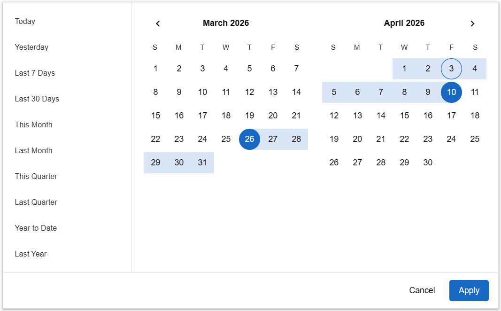
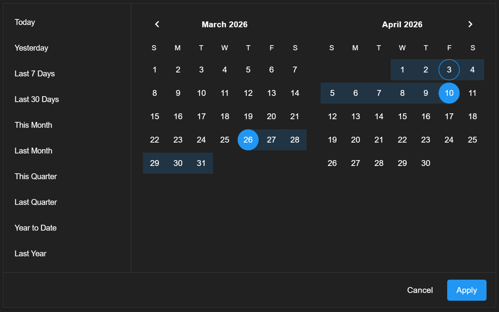

# @gigerit/vuetify-date-input-advanced





## <a href="https://vuetify-date-input-advanced.pages.dev/" target="_blank">Demo</a>

## Features

- Multi-month picker with range selection by default
- Single-date mode with `:range="false"`
- Inline picker or input-triggered overlay
- Desktop menu and mobile fullscreen dialog behavior in `VAdvancedDateInput`
- Typed input parsing and validation
- Built-in range presets plus custom preset slots
- `min`, `max`, `allowedDates`, `allowedStartDates`, and `allowedEndDates` constraints
- Configurable week start via `firstDayOfWeek`
- Optional week numbers
- Keyboard navigation and live announcements
- Theme-aware styling with CSS custom properties

Advanced date selection components for Vuetify 4.

`@gigerit/vuetify-date-input-advanced` provides two components:

- `VAdvancedDatePicker`: a standalone multi-month calendar panel
- `VAdvancedDateInput`: a `VTextField` wrapper that adds typed input, overlay behavior, and the same picker surface

The components use Vuetify's active date adapter through `useDate()`, so locale, formatting, and runtime value types follow your app's Vuetify date configuration.

## Exports

| Export                                                                                                                                                     | Description                        |
| ---------------------------------------------------------------------------------------------------------------------------------------------------------- | ---------------------------------- |
| `AdvancedDatePlugin`                                                                                                                                       | Registers both components globally |
| `VAdvancedDateInput`                                                                                                                                       | Text field wrapper + picker        |
| `VAdvancedDatePicker`                                                                                                                                      | Standalone picker panel            |
| `AdvancedDateModel`, `PresetRange`, `AdvancedDateAdapter`, `AdvancedDateDay`, `AdvancedDateMonthData`, `AdvancedDateWeek`, `DateBounds`, `NormalizedRange` | Public TypeScript types            |

## Requirements

- `vue@^3.5.0`
- `vuetify@^4.0.0`
- A Vuetify app already configured in your project
- An icon set that includes `mdi-calendar`, or a custom `appendInnerIcon`

## Install

```sh
npm install vue vuetify
npm install @gigerit/vuetify-date-input-advanced
```

Import the stylesheet once in your app entry:

```ts
import '@gigerit/vuetify-date-input-advanced/style.css'
```

Register the components globally:

```ts
import { createApp } from 'vue'
import App from './App.vue'
import vuetify from './plugins/vuetify'

import { AdvancedDatePlugin } from '@gigerit/vuetify-date-input-advanced'
import '@gigerit/vuetify-date-input-advanced/style.css'

createApp(App).use(vuetify).use(AdvancedDatePlugin).mount('#app')
```

If you prefer local registration, import `VAdvancedDateInput` and `VAdvancedDatePicker` directly instead of using `AdvancedDatePlugin`.

## Quick Start

```vue
<script setup lang="ts">
import { ref } from 'vue'
import type { AdvancedDateModel } from '@gigerit/vuetify-date-input-advanced'

const today = new Date()
const inSevenDays = new Date(today)
inSevenDays.setDate(today.getDate() + 6)

const value = ref<AdvancedDateModel<Date>>([today, inSevenDays])
</script>

<template>
  <v-advanced-date-input v-model="value" label="Travel dates" :months="2" />
</template>
```

Single-date mode:

```vue
<script setup lang="ts">
import { ref } from 'vue'
import type { AdvancedDateModel } from '@gigerit/vuetify-date-input-advanced'

const value = ref<AdvancedDateModel<Date>>(new Date())
</script>

<template>
  <v-advanced-date-input
    v-model="value"
    label="Departure"
    :range="false"
    :show-presets="false"
  />
</template>
```

Standalone inline picker with controlled visible month:

```vue
<script setup lang="ts">
import { ref } from 'vue'
import type { AdvancedDateModel } from '@gigerit/vuetify-date-input-advanced'

const value = ref<AdvancedDateModel<Date>>(null)
const month = ref(0)
const year = ref(2026)
</script>

<template>
  <v-advanced-date-picker
    v-model="value"
    v-model:month="month"
    v-model:year="year"
    :months="2"
    :first-day-of-week="1"
    :auto-apply="false"
  />
</template>
```

In the current implementation and tests, `month` is zero-based, so `0` is January.
Use `first-day-of-week` in templates to match Vuetify's `VDatePicker` behavior, where `0` is Sunday, `1` is Monday, and so on.

## Model Shapes

Examples below use native `Date`, but the actual runtime value type is the active Vuetify adapter type `TDate`.

| `range` | `returnObject` | Emitted shape              |
| ------- | -------------- | -------------------------- |
| `true`  | `false`        | `null` or `[start, end]`   |
| `true`  | `true`         | `null` or `{ start, end }` |
| `false` | ignored        | `null` or `date`           |

Notes:

- In range mode, the component accepts either a tuple or `{ start, end }` object as input.
- With `autoApply=true`, range selection can emit an incomplete value such as `[start, null]` after the first click.
- If the user picks an earlier end date, the range is normalized into chronological order before emit.

## Behavior

### Presets

Presets are shown only in range mode. If you omit `presets`, the picker generates these built-in options:

- `Today`
- `Yesterday`
- `Last 7 Days`
- `Last 30 Days`
- `This Month`
- `Last Month`
- `This Quarter`
- `Last Quarter`
- `Year to Date`
- `Last Year`

Custom preset shape:

```ts
type PresetRange<TDate> = {
  label: string
  value: [TDate, TDate] | (() => [TDate, TDate])
  slot?: string
}
```

If `preset.slot` is `"highlight"`, the picker looks for a `preset-highlight` slot before falling back to `preset`.

Presets that violate the active date constraints are rendered disabled and do not emit `presetSelect`.

Example:

```vue
<script setup lang="ts">
import type { PresetRange } from '@gigerit/vuetify-date-input-advanced'

const presets: PresetRange<Date>[] = [
  {
    label: 'Weekend Escape',
    slot: 'highlight',
    value: () => {
      const start = new Date('2026-01-16')
      const end = new Date('2026-01-18')
      return [start, end]
    },
  },
]
</script>

<template>
  <v-advanced-date-input :presets="presets" :auto-apply="false">
    <template #preset-highlight="{ preset }">
      <div class="d-flex align-center justify-space-between w-100">
        <span>{{ preset.label }}</span>
        <v-chip size="x-small" color="primary" variant="tonal">Custom</v-chip>
      </div>
    </template>
  </v-advanced-date-input>
</template>
```

### Typed Input

`VAdvancedDateInput` parses text on blur and on `Enter`.

Parsing order:

- `parseInput(value)` if provided
- `adapter.date(value)`
- ISO strings matching `YYYY-MM-DD...`
- native `Date.parse`

Validation uses the same `min`, `max`, `allowedDates`, `allowedStartDates`, and `allowedEndDates` constraints as calendar clicks.

Input formatting uses `displayFormat`, which is passed directly to `adapter.format(...)`. The default is `fullDate`.

Range text uses `rangeSeparator`, which defaults to `–`. The current implementation also accepts common spaced dash separators such as `-` and `—`.

### Input Attr Forwarding

When `VAdvancedDateInput` renders its default text field, non-prop attrs and listeners fall through to the internal `VTextField`. Use this for form-oriented attrs such as `id`, `name`, `aria-*`, `data-*`, and hooks such as `@blur` or `@keydown`.

```vue
<v-advanced-date-input
  v-model="value"
  id="booking-start-date"
  name="bookingStartDate"
  data-testid="booking-start-date"
  @blur="validateField"
/>
```

If you provide the `activator` slot, the slot content owns its own attrs and listeners.

### Overlay and Mobile Behavior

`VAdvancedDateInput` changes presentation by context:

- Desktop, non-inline: picker inside `VMenu`
- Mobile, non-inline: picker inside fullscreen `VDialog`
- `inline`: picker rendered directly with no overlay

On mobile, the picker switches to a vertically scrollable, windowed month list instead of desktop-style prev/next nav buttons.

### Apply / Cancel

`autoApply` controls calendar click behavior:

- `true`: updates `modelValue` as the user selects dates
- `false`: keeps a draft selection in the picker and shows `Apply` / `Cancel`

## API

### Shared Props

These props are accepted by both `VAdvancedDateInput` and `VAdvancedDatePicker`.

| Prop                | Type                                       | Default                   | Notes                                                                                                             |
| ------------------- | ------------------------------------------ | ------------------------- | ----------------------------------------------------------------------------------------------------------------- |
| `modelValue`        | `AdvancedDateModel<TDate>`                 | `null`                    | Current value                                                                                                     |
| `range`             | `boolean`                                  | `true`                    | Set `false` for single-date mode                                                                                  |
| `returnObject`      | `boolean`                                  | `false`                   | Range mode only; emits `{ start, end }` instead of a tuple                                                        |
| `months`            | `number`                                   | `2`                       | Visible month count, clamped to at least `1`                                                                      |
| `month`             | `number \| undefined`                      | current month             | Leading visible month                                                                                             |
| `year`              | `number \| undefined`                      | current year              | Leading visible year                                                                                              |
| `presets`           | `PresetRange<TDate>[] \| undefined`        | built-in range presets    | Ignored when `range=false`                                                                                        |
| `showPresets`       | `boolean`                                  | `true`                    | Shows or hides the preset list in range mode                                                                      |
| `swipeable`         | `boolean`                                  | `true`                    | Public prop; the current source does not attach swipe handlers                                                    |
| `autoApply`         | `boolean`                                  | `true`                    | `false` enables draft selection and footer actions                                                                |
| `min`               | `TDate \| null`                            | `null`                    | Minimum selectable date                                                                                           |
| `max`               | `TDate \| null`                            | `null`                    | Maximum selectable date                                                                                           |
| `allowedDates`      | `(date: TDate) => boolean`                 | `undefined`               | Shared per-day availability check applied to both endpoints                                                       |
| `allowedStartDates` | `(date: TDate) => boolean`                 | `undefined`               | Additional availability check for single dates and ordered range starts                                           |
| `allowedEndDates`   | `(date: TDate) => boolean`                 | `undefined`               | Additional availability check for ordered range ends                                                              |
| `showWeekNumbers`   | `boolean`                                  | `false`                   | Displays week numbers; uses adapter week calculations when available and otherwise falls back to ISO week numbers |
| `firstDayOfWeek`    | `string \| number \| undefined`            | adapter or locale default | Mirrors Vuetify `VDatePicker`; `0` starts weeks on Sunday, `1` on Monday, and so on                               |
| `disabled`          | `boolean`                                  | `false`                   | Applies disabled state to wrapper controls; day availability still comes primarily from date constraints          |
| `readonly`          | `boolean`                                  | `false`                   | Marks the input readonly; the manual action footer is hidden                                                      |
| `color`             | `string`                                   | `primary`                 | Accent color for selected days and range previews                                                                 |
| `theme`             | `string \| undefined`                      | inherited                 | Passed to the picker `VSheet`                                                                                     |
| `rounded`           | `string \| number \| boolean \| undefined` | `undefined`               | Passed to the picker `VSheet`                                                                                     |
| `border`            | `string \| number \| boolean`              | `true`                    | Passed to the picker `VSheet`                                                                                     |
| `elevation`         | `string \| number`                         | `2`                       | Passed to the picker `VSheet`                                                                                     |
| `width`             | `string \| number \| undefined`            | `undefined`               | Picker width                                                                                                      |
| `minWidth`          | `string \| number \| undefined`            | `undefined`               | Picker min width; also used for the desktop menu wrapper                                                          |
| `maxWidth`          | `string \| number \| undefined`            | `undefined`               | Picker max width                                                                                                  |
| `density`           | `'default' \| 'comfortable' \| 'compact'`  | `default`                 | Picker density and input density                                                                                  |

### `VAdvancedDateInput`-Only Props

| Prop               | Type                               | Default        | Notes                                                   |
| ------------------ | ---------------------------------- | -------------- | ------------------------------------------------------- |
| `menu`             | `boolean`                          | `false`        | Controlled open state for the menu or dialog            |
| `inline`           | `boolean`                          | `false`        | Renders the picker directly instead of using an overlay |
| `label`            | `string \| undefined`              | `undefined`    | Forwarded to `VTextField`                               |
| `placeholder`      | `string \| undefined`              | `undefined`    | Forwarded to `VTextField`                               |
| `variant`          | `string`                           | `outlined`     | Forwarded to `VTextField`                               |
| `hideDetails`      | `boolean \| 'auto'`                | `auto`         | Forwarded to `VTextField`                               |
| `messages`         | `string \| string[] \| undefined`  | `undefined`    | Forwarded to `VTextField`                               |
| `error`            | `boolean`                          | `false`        | Combines with internal parse and validation errors      |
| `errorMessages`    | `string \| string[] \| undefined`  | `undefined`    | Merged with internal parse and validation errors        |
| `rules`            | `readonly unknown[]`               | `[]`           | Forwarded to `VTextField`                               |
| `clearable`        | `boolean`                          | `false`        | Clears both text and model                              |
| `focused`          | `boolean`                          | `false`        | Forwarded to `VTextField`                               |
| `prependInnerIcon` | `string \| undefined`              | `undefined`    | Forwarded to `VTextField`                               |
| `appendInnerIcon`  | `string`                           | `mdi-calendar` | Forwarded to `VTextField`                               |
| `displayFormat`    | `string`                           | `fullDate`     | Passed to `adapter.format(...)` for text display        |
| `rangeSeparator`   | `string`                           | `–`            | Separator used for formatted range text                 |
| `parseInput`       | `(value: string) => TDate \| null` | `undefined`    | Custom parser used before adapter and native parsing    |

### Events

| Event               | Component | Payload                    | Notes                                                                  |
| ------------------- | --------- | -------------------------- | ---------------------------------------------------------------------- |
| `update:modelValue` | both      | `AdvancedDateModel<TDate>` | Main value update                                                      |
| `update:menu`       | input     | `boolean`                  | Overlay open state                                                     |
| `update:month`      | both      | `number`                   | Leading visible month after user navigation                            |
| `update:year`       | both      | `number`                   | Leading visible year after user navigation                             |
| `apply`             | both      | `AdvancedDateModel<TDate>` | Fired when Apply is used with `autoApply=false`                        |
| `cancel`            | both      | none                       | Fired from picker cancel flows, including `Escape` inside the calendar |
| `presetSelect`      | both      | `PresetRange<TDate>`       | Fired when a preset is chosen                                          |

### Slots

All picker slots can be passed either directly to `VAdvancedDatePicker` or through `VAdvancedDateInput`, which forwards them to the internal picker.

| Slot            | Component | Slot props                                                                                    |
| --------------- | --------- | --------------------------------------------------------------------------------------------- |
| `activator`     | input     | `{ props, isOpen }`                                                                           |
| `day`           | both      | `{ date, outside, disabled, today, selected, rangeStart, rangeEnd, inRange, preview, props }` |
| `preset`        | both      | `{ preset, active, disabled, props }`                                                         |
| `preset-<name>` | both      | Same as `preset`, selected when `preset.slot === '<name>'`                                    |
| `actions`       | both      | `{ apply, cancel, disabled }`                                                                 |

When overriding `day`, spread the provided `props` onto your interactive element to preserve keyboard and ARIA behavior.

### Exposed Picker Methods

A `ref` on `VAdvancedDatePicker` exposes these methods:

| Method              | Description                                     |
| ------------------- | ----------------------------------------------- |
| `focusDate(date)`   | Navigates if needed and focuses a specific date |
| `focusActiveDate()` | Focuses the active or first available date      |
| `prevMonth()`       | Moves to the previous visible month             |
| `nextMonth()`       | Moves to the next visible month                 |

## Styling and Theming

Import `@gigerit/vuetify-date-input-advanced/style.css` once. The picker uses `.v-advanced-date-picker` as its root class. The input wrapper uses `.v-advanced-date-input`.

Key CSS custom properties:

| Variable                             | Default                                        | Purpose                    |
| ------------------------------------ | ---------------------------------------------- | -------------------------- |
| `--v-advanced-date-picker-color`     | `rgb(var(--v-theme-primary))`                  | Accent color               |
| `--v-advanced-date-range-bg`         | computed                                       | Confirmed range background |
| `--v-advanced-date-range-preview-bg` | computed                                       | Hover-preview background   |
| `--v-advanced-date-selected-bg`      | `var(--v-advanced-date-picker-color)`          | Selected day background    |
| `--v-advanced-date-selected-color`   | `rgb(var(--v-theme-on-primary))`               | Selected day text color    |
| `--v-advanced-date-preset-width`     | `220px`                                        | Preset column width        |
| `--v-advanced-date-cell-size`        | `40px`                                         | Calendar cell size         |
| `--v-advanced-date-day-size`         | `calc(var(--v-advanced-date-cell-size) - 4px)` | Day button size            |
| `--v-advanced-date-day-inset`        | computed                                       | Range background inset     |
| `--v-advanced-date-gap`              | `24px`                                         | Gap between visible months |

Example:

```css
.booking-picker {
  --v-advanced-date-preset-width: 18rem;
  --v-advanced-date-cell-size: 44px;
  --v-advanced-date-picker-color: rgb(var(--v-theme-secondary));
}
```

The `color` prop updates the emphasis color by setting `--v-advanced-date-picker-color` from the active Vuetify theme.

## Accessibility and Keyboard

The current implementation includes:

- Per-day `aria-label`, `aria-selected`, `aria-disabled`, and `aria-current="date"`
- A live region that announces visible months and selected values
- Roving focus across day buttons
- Keyboard navigation on the calendar grid

Keyboard shortcuts:

| Key                               | Behavior                                                           |
| --------------------------------- | ------------------------------------------------------------------ |
| `ArrowLeft` / `ArrowRight`        | Move 1 day                                                         |
| `ArrowUp` / `ArrowDown`           | Move 1 week                                                        |
| `Home` / `End`                    | Move to start or end of the current week based on `firstDayOfWeek` |
| `PageUp` / `PageDown`             | Move 1 month                                                       |
| `Shift+PageUp` / `Shift+PageDown` | Move 1 year                                                        |
| `Enter` / `Space`                 | Select active day                                                  |
| `Escape`                          | Cancel picker interaction                                          |

## Development

Repository layout:

- `src/`: components, composables, utilities, styles, and plugin entry
- `playground/`: local Vite app for manual QA
- `tests/`: Vitest and Vue Test Utils coverage
- `dist/`: generated build output

Useful scripts:

```sh
npm install
npm run dev
npm run typecheck
npm run test
npm run lint
npm run build
npm run format
```

## CI

GitHub Actions now validates the repo automatically with `.github/workflows/ci.yml`.

- pull requests to `main`, pushes to `main`, and manual `workflow_dispatch` runs execute the same core checks used locally
- the workflow installs dependencies with `npm ci` and runs `npm run typecheck`, `npm run lint`, `npm run test`, and `npm run build`
- the job uses Node `22.x`, matching the current release pipeline runtime
- in-progress runs for the same ref are canceled when a newer commit is pushed

Before opening a PR, the matching local safety check is:

```sh
npm run typecheck
npm run lint
npm run test
npm run build
```

## Releases

Releases are automated from `.github/workflows/release.yml`.

- `.github/workflows/ci.yml` handles routine validation for pushes and pull requests
- `googleapis/release-please-action` opens and maintains the release PR from conventional commits on `main`
- when that release PR is merged, GitHub Actions builds, validates, and publishes the package to npm with provenance
- npm publishing is configured for trusted publishing via GitHub OIDC, so no long-lived `NPM_TOKEN` is required in the workflow

Because npm trusted publishers can only be configured for packages that already exist on the registry, the first publish still has to be done manually by an authenticated maintainer.

After the initial publish, configure the package as a trusted publisher for this repository and workflow in npm, or with npm CLI v11.10.0+:

```sh
npm trust github @gigerit/vuetify-date-input-advanced \
  --repo gigerIT/vuetify-date-input-advanced \
  --file .github/workflows/release.yml
```

Verified from the repository configuration:

- The library is built with Vite in library mode
- Output formats are ESM and CommonJS
- Declaration files are generated from `src/`
- Styles are exported as `@gigerit/vuetify-date-input-advanced/style.css`
- Tests run in `jsdom` with Vuetify bootstrapped in Vue Test Utils

## Notes

- Examples in this README use native `Date`, but the actual value type follows your configured Vuetify date adapter.
- The default input icon is `mdi-calendar`. If your app does not provide that icon, configure an icon set or override `appendInnerIcon`.
